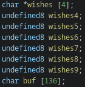

# Christmas


This is by far the hardest pwn challenge in the competition.

Unfortunately, I wasn't able to complete it in time. However, I was able to solve it after the CTF had ended.

The program was fairly simple with only one function.

We had 4 options when running the program:


1) Add wish

    - This was a malloc function where we could create a "wish" (chunk) with any size. We must also specify the index and size.

2) Remove wish

    - This was a free function. However, a simple double free or use after free is not possible as they set the pointer to the chunk to null after they are done using it. (Good programming practices?? :astonished:)

3) View wish

    - This just printed out the contents of our chunk with puts.

4) Exit

    - This just breaks out of the loop and exits the program.

Here is the decompilation that Ghidra has provided:

```c

void main(void)

{
  int choice;
  char *chunkPointer;
  long wishIndex;
  long in_FS_OFFSET;
  char *wishes [4];
  char *wishes4;
  char *wishes5;
  char *wishes6;
  char *wishes7;
  char *wishes8;
  char *wishes9;
  char buf [136];
  undefined8 canary;
  
  canary = *(undefined8 *)(in_FS_OFFSET + 0x28);
  wishes[0] = (char *)0x0;
  wishes[1] = (char *)0x0;
  wishes[2] = (char *)0x0;
  wishes[3] = (char *)0x0;
  wishes4 = 0;
  wishes5 = 0;
  wishes6 = 0;
  wishes7 = 0;
  wishes8 = 0;
  wishes9 = 0;
  setup();
  banner();
  while( true ) {
    print_menu();
    fgets(buf,128,stdin);
    choice = atoi(buf);
    if (choice == 4) break;
    if (choice < 5) {
      if (choice == 3) {
        puts("Make my wish come true");
        printf("> ");
        fgets(buf,0x80,stdin);
        choice = atoi(buf);
        wishIndex = (long)choice;
        if ((wishIndex < 0) || (9 < wishIndex)) {
          printf("Don\'t care about the presents underneath %ld and %ld\n",0,9);
        }
        else if (wishes[wishIndex] == (char *)0x0) {
          puts("Santa, won\'t you bring me the one I really need?");
        }
        else {
          puts("All I want for Christmas is");
          puts(wishes[wishIndex]);
        }
      }
      else if (choice < 4) {
        if (choice == 1) {
          puts("There\'s just one thing I need");
          printf("> ");
          fgets(buf,0x80,stdin);
          choice = atoi(buf);
          wishIndex = (long)choice;
          if (wishIndex < 10) {
            puts("I won\'t ask for much this Christmas");
            printf("> ");
            fgets(buf,128,stdin);
            choice = atoi(buf);
            if ((long)choice < 0) {
              puts("Invalid size");
            }
            else {
              chunkPointer = (char *)malloc((long)choice);
              wishes[wishIndex] = chunkPointer;
              puts("All I want for Christmas is");
              printf("> ");
              fgets(wishes[wishIndex],choice,stdin);
            }
          }
          else {
            printf("Don\'t care about the presents underneath %ld and %ld\n",0,9);
          }
        }
        else if (choice == 2) {
          puts("I won\'t make a list");
          printf("> ");
          fgets(buf,0x80,stdin);
          choice = atoi(buf);
          wishIndex = (long)choice;
          if ((wishIndex < 0) || (9 < wishIndex)) {
            printf("Don\'t care about the presents underneath %ld and %ld\n",0,9);
          }
          else {
            free(wishes[wishIndex]);
            wishes[wishIndex] = (char *)0x0;
          }
        }
      }
    }
  }
  bye();
  exit(0);
}
```

## Vulnerabilities

This program only has 2 obvious vulnerabilities at first glance.

Both are in line 62 of the ghidra decompilation of the main function.


We can see that the program checks if the index that we entered is less than 10. This is sus as in the other options, the maximum index is always set to 9.

The array storing our chunks is indeed only 10 elements long, meaning we can allocate a chunk that is out of bounds into our buffer, as the buffer is the variable right after the array of chunks.



This is absolutely useless and I don't know why it exists, probably just to annoy me or smth.

The second vulnerability is the more important one. 

The malloc function doesn't check whether our index is less than 0. Meaning that we can allocate chunks into variables before the wish index. Let us look at what variables lie before the array of chunks.


None of these help us when overwritten. 

However, Ghidra is a liar. There is actually another variable before the array of chunks that is not shown.

Lets look at the disassembly of the main function. Here is the important part:


In this code, the program is taking a variable from `RBP-0x100` and comparing it with our input. using `tel RBP-0x100`, we can see that the value there is 0xa (or 10).


The program is comparing out input to 10. This is where the check if our `wishIndex` is too high. Notice how the limit variable is stored at `RBP-0x100`. That means that its a variable that is before the array of wishes (at `RBP-0xe0`). We can overwrite it.

The index that we need to enter and overwrite can be calculated with `(0xe0 - 0x100) / 8`. This gives `-4`. Lets test it.


As you can see, the maximum limit has been modified to `93824992260767`. The hex of that is `0x55555555b29f`, which is conveniently the address of our chunk, and we can use this to calculate heap base, although I used a different method.

Now that the limit has been changed, what else can we do?

The only variables after the array of chunks is our buffer.

We can control our buffer to put whatever we want in there.

Putting two and two together, you may realise that we can enter in whatever address we want into our buffer, and then call `free()` on it, effectively allowing us to perform a double free, use after free, or basically whatever heap attack you wanted.

Now that we have all of our vulnerabilities established, let me explain my solution.

### Part 1: Leaking

Before we can do some crazy shenanegains to obtain a shell, we absolutely have to leak some addresses. 

#### Heap Base

We need heap base in order to calculate the address of our chunks to perform various heap-based attacks.

The heap base can be easily found by allocating a chunk of size 0-0x20, freeing it, and allocating another chunk of size 0.

The chunk that we initially allocate will be freed, and the FD pointer will point to the previous chunk. If this was the first chunk, then it will conveniently point to heap base.

In order to read the value of the FD pointer, I will allocate another chunk of size 0. This will overwrite nothing in the chunk, and when we call `View wish` on our chunk index, it will print out the unmodified FD pointer there.

```py
malloc(0, b'', 1)
free(1)
malloc(0, b'', 1)
heapBase = u64(read(1).ljust(8, b'\x00')) * 0x1000
print(f"Got Heap Base: {hex(heapBase)}")
```

#### Libc Base

The only option we have to print things is the 3rd option, `View wish`. This option when simplified, basically takes in a pointer and returns the value that the pointer is pointing to.

Since we have overwritten the maximum boundry earlier, we can control whatever we want to read. Unfortunately, PIE is enabled, so we don't know the address of any function or GOT. This leaves us only one way to leak Libc base with the information we have.

Coincidentally, it involves the FD pointer again.

If we allocate a huge chunk (for example size 0x400), and free it, it will not enter in the tcache, but will instead but put in the unsorted bin. 

The FD pointer in the unsorted bin is different, as it points to the main_arena instead. We can use the main_arena pointer to calculate Libc base.


Do note that if you free a huge chunk and there isn't a chunk after it, the chunk will be "consolidated" and combined with the forest, preventing you from access the FD pointer.

As such, I will allocate another chunk after the big one to prevent this consolidation.

After that, we will allocate a chunk of size 0, and the huge unsorted bin chunk will be split into two, one for our new chunk and the remainder will continue being free.

```py
malloc(0x450, b'unsorted bin chunk', 2)   
malloc(0x16, b'padding', 3)
free(2)
malloc(0, b'', 2)
libcBase = u64(read(2).ljust(8, b'\x00')) - libc.symbols['main_arena'] - 1120
print(hex(libcBase))
```

### Part 2: Leaking the Pointer Guard

Man I structured this write-up horribly. It seems like I'm still leaking stuff.

Now that we have our addresses, we have to find a way to obtain a shell. 

Notice that the Libc version provided to us is 2.35. You can find this by doing `grep -a "GNU C Library" libc.so.6`. In this newer version of libc, `__free_hook` exists, but isn't used. As such, even if we overwrote it with `system()`, it will never be called and we won't get our shell.

Since the binary has Full RELRO protection, we also can't overwrite the GOT. As such, I only have one idea left, which was to overwrite the exit handler functions.

My write-up is long enough so I'll just summarise briefly and inaccurately what the exit handlers are.

When a program exits, it runs an exit function. This is defined in `intial`. You can check all the exit functions during a program's runtime with `p initial` in GDB.


For some reason, the exit handlers are writeable, so we can write our `system()` there and when the program exits, it will call `system()` instead.

Read up more about exit handlers [here](pictures/https://m101.github.io/binholic/2017/05/20/notes-on-abusing-exit-handlers.html).

All of the exit handler function address are "mangled", basically encrypted so an attacker can't just enter in their function there. As such, we have to leak the key (AKA pointer guard) they used to for their encryption.

The key to the exit handler is always right after the place where the canary is stored. We can find this place in GDB pwndbg with `canary` to find the canary addresses, and then `search -t qword <canary>`. 


The place where the original canary is stored is the first one.

Taking that, we can minus Libc base from it and add 8 to get the address where the key is stored.

After that we can leak it the same way we leaked Libc base.

```py
p.sendlineafter(b'>', b'3'.ljust(8) + pack(libcBase - 10392 + 8))
p.sendlineafter(b'>', b'11')
p.recvuntil(b'is\n')
ptrGuard = u64(p.recvline().strip().ljust(8, b'\x00'))
print(hex(ptrGuard))
```

By the way, the function to encrypt our pointer is this:

```py
rol = lambda val, r_bits, max_bits: \
    (val << r_bits%max_bits) & (2**max_bits-1) | \
    ((val & (2**max_bits-1)) >> (max_bits-(r_bits%max_bits)))

def ptrMangle(v, key):
    return p64(rol(v ^ key, 0x11, 64))
```

### Part 3: Overwriting the Exit Handler

Finally. I bet no one is reading this far.

Among us sussy wussy awooga.

We can get the address of initial with `p &initial` and subtracting the Libc base from that.

Now we overwrite it. There is a variety of ways to do this, but I will do the most easy method that I know of.

First, I create a huge chunk. It doesn't matter how large it is, as long as its big enough.

Then, I will put in the big chunk a forged chunk, freeing it by entering the address of the forged chunk into our buffer.

Finally, I will free the huge chunk, allocated it again with the same size, and overwrite my forged chunk to change the FD pointer to point to the exit handler. The 2nd next time I allocate a chunk the same size as my forged chunk, the address at the exit handler will be returned instead, allowing us to overwrite it.

What we will be overwriting the exit handler with is this:

```py
pack(4) + ptrMangle(libc.symbols['system'] + libcBase, ptrGuard) + pack(libcBase + next(libc.search(b'/bin/sh')))
```

Let me explain.

We will be writing this at the address of `initial + 16`. This is because what we want to overwrite are the entries in the exit handler. The first few variables are fine as they are.

Exit handlers have multiple types, and the type that we want is `4`, which takes in exactly one argument. This is perfect for calling `system('/bin/sh')`. As mentioned before, exit handlers have an "encryption" of sorts, so we use the leaked pointer guard to encrypt the pointer to `system()` in Libc.

The following `pack(libcBase + next(libc.search(b'/bin/sh')))` is the argument that will be passed into the function.

This way, when the program exits, it will call `system('/bin/sh')`

The entire solve script can be found in `main.py`.

