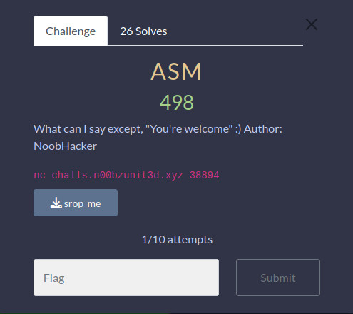
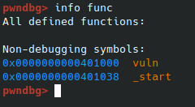
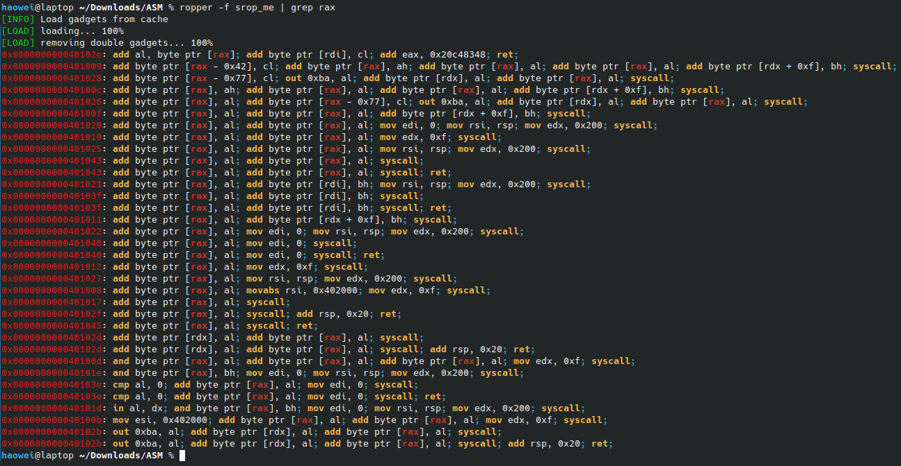
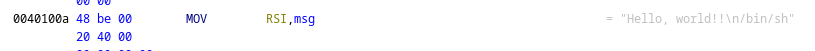
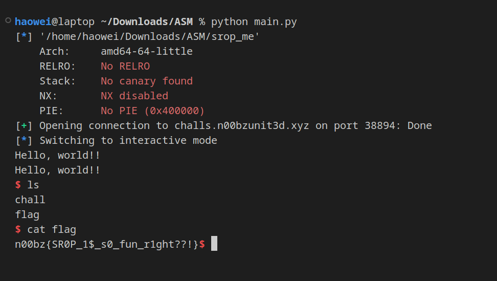

# ASM

This challenge was the most difficult of all the pwn challenges. We are given a bare binary, with only two functions, _start and vuln.

This was probably written in pure assembly, which is why its missing all the other functions like puts or printf.

This time, unlike pwn3, we truly have nothing, nother than syscall.

Syscall is very powerful, however, in order to control what the syscall function does, we need to be able to control the RAX register.

Using ropper and grep, we can see which ROP gadgets contain rax in them.

...that is not a lot. We don't have any direct way of popping RAX and inserting a value.

The name of the binary is obviously eluding to SROP, or sigreturn oriented programming. Sigreturn is a very powerful syscall which basically resets all the regsiters (idk this is my first time doing SROP). However, to invoke it, the rax value must be set to 59.

RAX is a very special register, in that it is where return values are usually stored. As such, although we can't control the RAX register directly, we could in theory invoke a function that would return the value that we need. 

One big contender was the read funciton, which returns the amount of bytes read.

Another issue that we have is that we don't have a binsh string! However, on closer inspect of the bianry in ghidra, we can see this little guy:

Now that we have everything, here is our plan of attack:
1) overflow to RIP, then return to _vuln
2) enter 0xf bytes (for sigreturn)
3) fill the registers with appropriate values
4) get shell

Solve script in main.py

Wow it works!!

Flag:
n00bz{SR0P_1$_s0_fun_r1ght??!}
