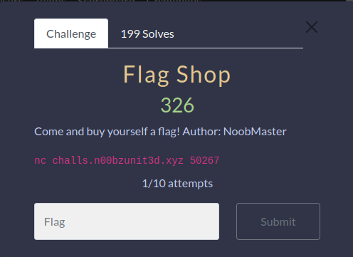
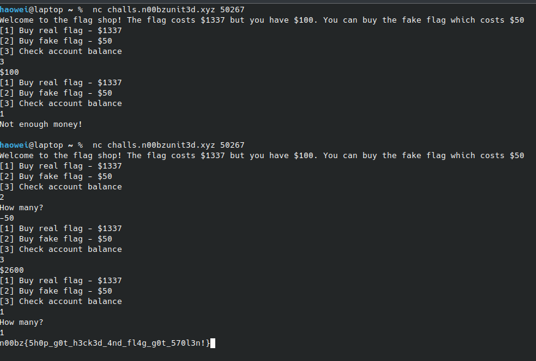

# Flag shop

When connecting to the server, we can see that there are three options, to buy the real flag, fake flag, or check balance.

When trying to buy the flag, we are told that we don't have enough money.

Since the binary was not provided, that meant that the challenge was supposed to be exceedingly simple. As such, the first thing that came to mind was to just buy negative fake flags.

Wow it worked, who would have guessed?

Flag:
n00bz{5h0p_g0t_h3ck3d_4nd_fl4g_g0t_570l3n!}
