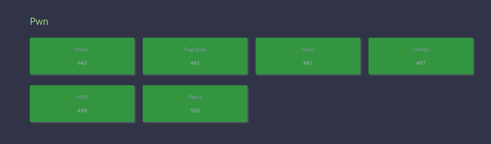

# n00bzCTF

Over the past few days, I participated in n00bzCTF by myself (and did quite poorly ~40th place).

However, I did bring back one achievement, which was that I full solved pwn.

Just a few months ago I sucked at pwn and didn't even know pwntools existed. But now, I can gaze upon my eyes this beautiful scene:

As such, I decided to write write-ups for all of the pwn challs as a celebration of my improvement.