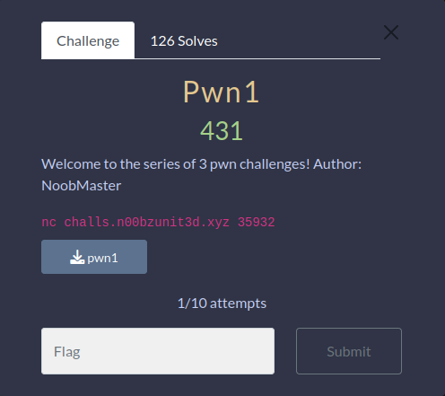

# pwn1

Upon running the binary, we can see that the program takes our input. When we enter in a long enough input, it Segmentation Faults. 

Segmentation faults can mean a lot of things, but it means that the program is trying to access memory that it doesn't have permission to. 

In this case, we overflowed the buffer and overwritten the RIP with our input. The program then tries to access the function at the address, but segmentation faults because nothing exists over there.

A useful tool is GDB, which is a debugger that allows you to see the program's stack during runtime. Furthermore, it also tells us what functions there are in the program. In this case, there was a `win` function. Disassembling it shows us that it is doing a system call of some kind. It was probably giving us a shell.

Using GDB, we can get the offset of the funcitons RIP with cyclic. However, in our case, that doesn't really happen...

Pro-tip: the offest of the RIP in 64-bit binaries is usually just the size of the buffer + 8. As such, we don't need cyclic to figure out the offset since we can just decompile it with ghidra

Here is our plan of attack
1) overflow the buffer just before the RIP
2) add in the address of the `win` function into the RIP

This should give us the shell and allow us to get the flag.

Wow it works, who would have guessed?
This type of attack is known as ret2win.

Flag:
n00bz{PWN_1_Cl34r3d_n0w_0nt0_PWN_2!!!}
