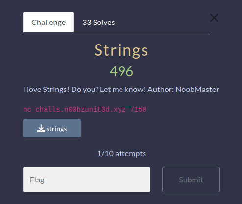
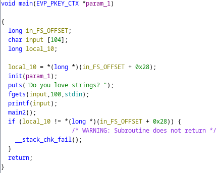
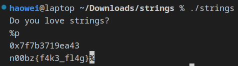
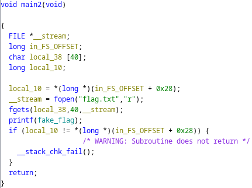
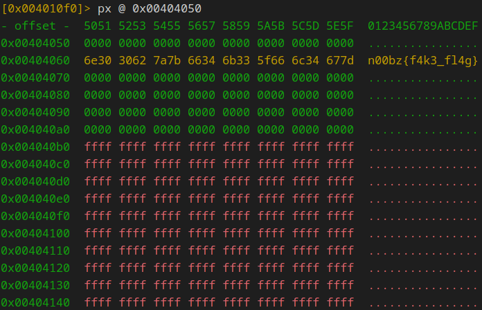
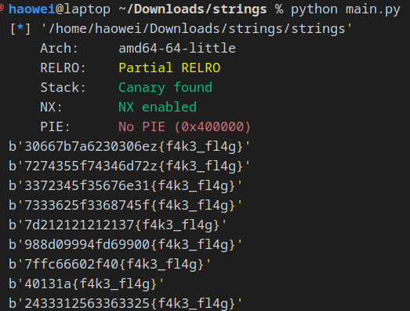
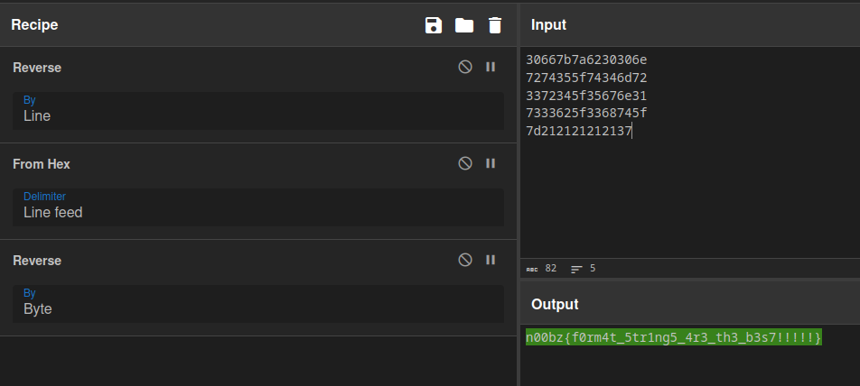

# strings

This was quite the interesting challenge! It felt quite satisfying solving it.

When we decompile the file, we can see that the program is taking our input. However, it only takes 100 bytes, which is less than the buffer size of 104. As such, we don't have any buffer overflow attacks.

However, something to note is that the program immediately printfs our input. This is known as a format string attack. In C, when you call printf, you can specify various format strings to print out variables. However, if you directly pass in a variable into printf, you can define format strings within the variable. In this case, we can control the variable that is going in, so in theory we could pass in some format string specifiers, and the program would run them.

Let's test out our hypothesis

Wow it works.

Another thing to note is that there is another function within the binary, called `main2`. Within this function we can see that the program is reading the flag variable, but then prints out the fake flag variable. 

With format string, we can get arbitrary write to any location with the `%n` specifier. Idk how this works but it does.

So honestly we have quite a bit of options with arbitrary write, but I thought that the easiest way was to leak the flag variable. However, this is only possible after flag variable is initliased. As such, our format string would not be able to leak it.

Still, there was another place that we can format string, that was the fake flag variable. Using arbitrary write, we can overwrite the data within the fake flag variable with format strings. Since the fake flag variable is only printed out after the flag is initialised onto the stack, we can use format string there to leak out the flag.

In order to do that, we had to figure out where the fake flag was stored. It is usually in the .data section of a binary.

Using r2, we can use `iS` to see all the sections, and use `px @ <address>` to print out what is within the address.

Now that we have the address of the fake flag, we can write our solve script

script in main.py

Running this, we quickly get a lot of outputs.

With some cyberchef tricks, we can get the full flag.

Btw we have to reverse it cause its in little endian format.

Flag:
n00bz{f0rm4t_5tr1ng5_4r3_th3_b3s7!!!!!}
